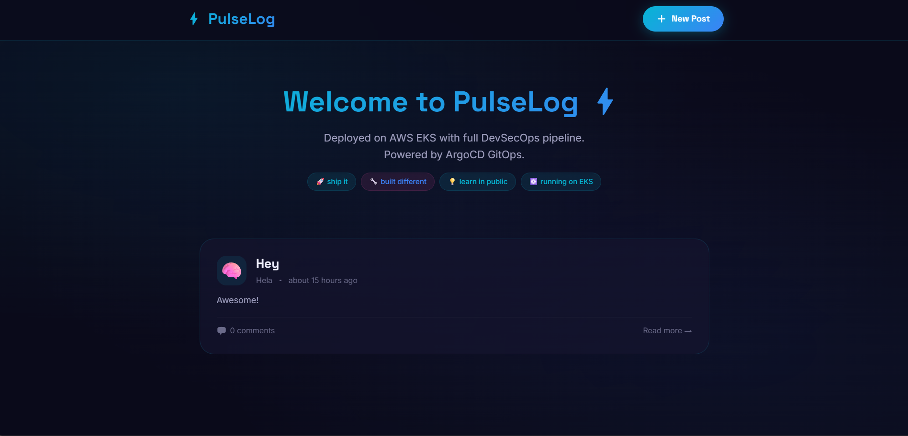
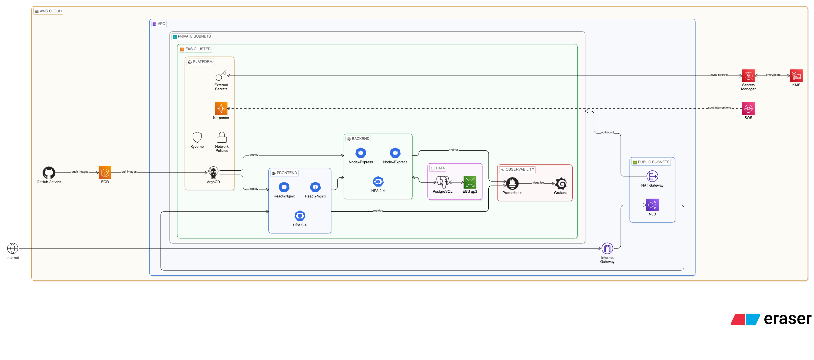
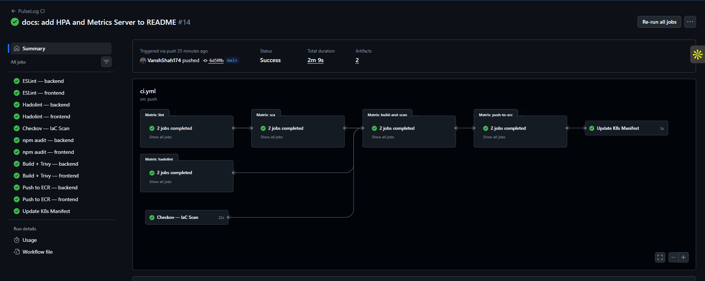
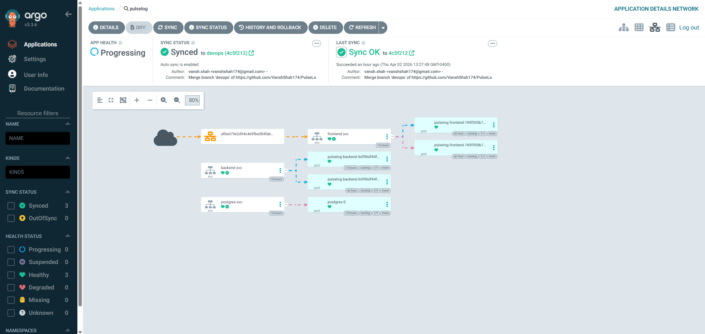
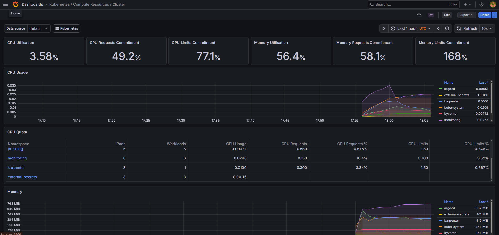
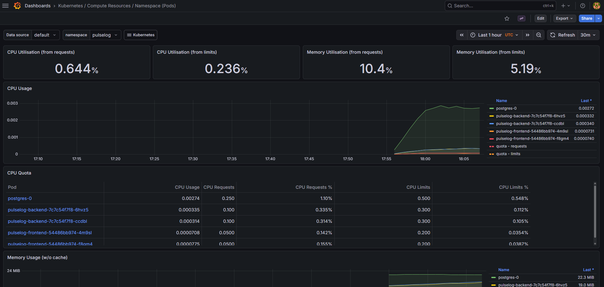

<p align="center">
  
  
  
  
  
  
</p>

# PulseLog — Secure, Scalable DevSecOps on AWS EKS

A full-stack developer blog platform engineered to production standards on AWS — automated CI/CD, policy enforcement, KMS-encrypted secrets management, Spot-optimized node provisioning, and zero-trust networking. Every layer, from Terraform to runtime, is security-hardened and fully auditable.

<p align="center">
  
</p>

---

## 📋 Table of Contents

- [Architecture Overview](#-architecture-overview)
- [Tech Stack](#-tech-stack)
- [Repository Structure](#-repository-structure)
- [Infrastructure (Terraform)](#-infrastructure-terraform)
- [CI Pipeline — GitHub Actions](#-ci-pipeline--github-actions)
- [CD Pipeline — ArgoCD](#-cd-pipeline--argocd)
- [Kubernetes Architecture](#-kubernetes-architecture)
- [Security Layers](#-security-layers)
- [Secrets Management](#-secrets-management)
- [Karpenter — Node Auto-Provisioning](#-karpenter--node-auto-provisioning)
- [HPA — Pod Auto-Scaling](#-hpa--pod-auto-scaling)
- [Observability — Prometheus & Grafana](#-observability--prometheus--grafana)
- [Network Policies](#-network-policies)
- [Kyverno — Policy Enforcement](#-kyverno--policy-enforcement)
- [Branch Strategy](#-branch-strategy)
- [Getting Started](#-getting-started)
- [Deployment Order](#-deployment-order)

---

## 🏗 Architecture Overview

<p align="center">
  
</p>

```
┌─────────────────────────────────────────────────────────────────────┐
│                        GitHub Repository                            │
│                                                                     │
│   main branch ──► CI Pipeline (8 stages) ──► ECR (images)          │
│                                    │                                │
│                                    ▼                                │
│   devops branch ◄── Update K8s manifests with new image tags       │
│        │                                                            │
│        ▼                                                            │
│   Infra CI Pipeline (Checkov + Kubeconform)                        │
└────────┬────────────────────────────────────────────────────────────┘
         │
         ▼
┌─────────────────────────────────────────────────────────────────────┐
│                     ArgoCD (GitOps)                                  │
│         Watches devops branch → auto-syncs to EKS                   │
└────────┬────────────────────────────────────────────────────────────┘
         │
         ▼
┌─────────────────────────────────────────────────────────────────────┐
│                        AWS EKS Cluster                              │
│                                                                     │
│  ┌──────────┐    ┌──────────┐    ┌──────────┐    ┌──────────┐     │
│  │ Frontend │◄──►│ Backend  │◄──►│ Postgres │    │ Karpenter│     │
│  │ (React)  │    │ (Node.js)│    │ (StatefulSet) │ (Spot)   │     │
│  │ HPA 2→4      │ HPA 2→4      │ 1 replica│    │          │     │
│  └──────────┘    └──────────┘    └──────────┘    └──────────┘     │
│                                                                     │
│  ┌──────────┐    ┌──────────┐    ┌──────────┐                     │
│  │ Kyverno  │    │ Network  │    │ External │                     │
│  │ Policies │    │ Policies │    │ Secrets  │                     │
│  └──────────┘    └──────────┘    └──────────┘                     │
│                                       │                             │
│  ┌──────────┐    ┌──────────┐         ▼                            │
│  │Prometheus│    │ Grafana  │  AWS Secrets Manager                 │
│  │(metrics) │───►│(dashboards)  (KMS CMK encrypted)               │
│  └──────────┘    └──────────┘                                      │
└─────────────────────────────────────────────────────────────────────┘
```


---

## 🛠 Tech Stack

| Layer | Technology | Purpose |
|-------|-----------|---------|
| **Frontend** | React 18 + Vite + Nginx | SPA blog UI with SSR-ready routing |
| **Backend** | Node.js 22 + Express | REST API for posts and comments |
| **Database** | PostgreSQL 16 (Alpine) | Persistent storage via StatefulSet + EBS |
| **Infrastructure** | Terraform | VPC, EKS, ECR, IAM, KMS, Secrets Manager |
| **Container Registry** | AWS ECR | Immutable image tags, scan-on-push |
| **Orchestration** | AWS EKS (K8s 1.32) | Managed Kubernetes control plane |
| **CI** | GitHub Actions | 8-stage pipeline with security scanning |
| **CD** | ArgoCD | GitOps auto-sync from devops branch |
| **Node Scaling** | Karpenter | Spot-first auto-provisioning with consolidation |
| **Pod Scaling** | HPA + Metrics Server | CPU-based auto-scaling (2–4 replicas) |
| **Observability** | Prometheus + Grafana | Cluster metrics, dashboards, alerting |
| **Secrets** | AWS Secrets Manager + ESO | KMS-encrypted, Pod Identity, auto-synced |
| **Policy Engine** | Kyverno | Enforce non-root, no :latest, require resources |
| **Network Security** | K8s NetworkPolicy | Zero-trust pod-to-pod communication |
| **Load Balancing** | Gateway API + NLB | Layer 7 routing via AWS LB Controller |
| **Storage** | EBS CSI Driver (gp3) | Encrypted persistent volumes for Postgres |
| **Auth** | OIDC + Pod Identity | Keyless AWS auth for CI and pods |

---

## 📁 Repository Structure

```
├── .github/workflows/
│   ├── ci.yml                    # Main branch — 8-stage CI pipeline
│   └── infra-ci.yml              # Devops branch — Checkov + Kubeconform
│
├── frontend/                     # React 18 + Vite SPA
│   ├── src/
│   │   ├── components/           # Navbar, PostCard, CommentSection, ConfirmModal
│   │   └── pages/                # Home, PostDetail, CreatePost, EditPost
│   ├── Dockerfile                # Multi-stage: node build → nginx production
│   └── nginx.conf                # Local dev config (K8s uses ConfigMap)
│
├── backend/                      # Node.js + Express API
│   ├── src/
│   │   ├── index.js              # Express server + health check
│   │   ├── db.js                 # PostgreSQL connection + schema init
│   │   └── routes/               # /api/posts, /api/comments
│   └── Dockerfile                # Multi-stage: npm ci → dumb-init production
│
├── terraform/                    # Infrastructure as Code
│   ├── vpc.tf                    # VPC, subnets, NAT, route tables
│   ├── eks.tf                    # EKS cluster, addons, node group
│   ├── ecr.tf                    # ECR repos (immutable tags, scan-on-push)
│   ├── karpenter.tf              # Karpenter IAM + Pod Identity + SQS
│   ├── ebs-csi.tf                # EBS CSI driver IAM + Pod Identity
│   ├── alb.tf                    # ALB Controller IAM + Pod Identity
│   ├── secrets.tf                # Secrets Manager + KMS + ESO IAM
│   ├── oidc.tf                   # GitHub Actions OIDC provider + IAM
│   ├── variables.tf              # Input variables
│   ├── outputs.tf                # Useful outputs (ARNs, URLs, commands)
│   └── provider.tf               # AWS provider + default tags
│
├── k8s/                          # Kubernetes manifests (ArgoCD watches this)
│   ├── namespace.yaml            # pulselog namespace
│   ├── backend/                  # Deployment, Service, ServiceAccount, PDB, HPA
│   ├── frontend/                 # Deployment, Service, ServiceAccount, PDB, ConfigMap, HPA
│   ├── postgres/                 # StatefulSet, Service, PVC, StorageClass
│   ├── gateway/                  # Gateway, GatewayClass, HTTPRoute
│   ├── karpenter/                # NodePool, EC2NodeClass, Helm values
│   ├── kyverno/                  # 3 ClusterPolicies (security enforcement)
│   ├── networkpolicy/            # 3 NetworkPolicies (zero-trust)
│   ├── external-secrets/         # ClusterSecretStore + ExternalSecret
│   └── argocd/                   # Application, namespace, install guide
│
└── docs/                         # Learning notes and concepts
```

---

## ☁️ Infrastructure (Terraform)

All infrastructure is provisioned via Terraform with no manual ClickOps.

### VPC Architecture
```
VPC (10.0.0.0/16)
├── Public Subnets (3 AZs)     → NLB, Internet Gateway
├── Private Subnets (3 AZs)    → EKS nodes, NAT Gateway
├── NAT Gateway (single)       → Cost-optimized for dev
└── Route Tables                → Public → IGW, Private → NAT
```

### EKS Cluster
- **Version**: Kubernetes 1.32
- **Auth**: API mode with access entries (no aws-auth ConfigMap)
- **Logging**: API, audit, authenticator, controller manager, scheduler
- **Addons**: Pod Identity Agent, CoreDNS, kube-proxy, VPC CNI, EBS CSI, Metrics Server

### IAM — Pod Identity (not IRSA)
All pod-level AWS authentication uses **EKS Pod Identity** — the modern replacement for IRSA. No OIDC provider needed for pods, no service account annotations.

| Component | IAM Role | Pod Identity Association |
|-----------|----------|------------------------|
| Karpenter | `pulselog-karpenter` | `karpenter/karpenter` |
| EBS CSI | `pulselog-ebs-csi-role` | `kube-system/ebs-csi-controller-sa` |
| ALB Controller | `pulselog-alb-controller-role` | `kube-system/aws-load-balancer-controller` |
| External Secrets | `pulselog-external-secrets-role` | `external-secrets/external-secrets` |

### ECR Repositories
- `pulselog-frontend` and `pulselog-backend`
- **Immutable tags** — no overwriting images
- **Scan on push** — automatic CVE scanning
- **Lifecycle policy** — keep last 10 images


---

## 🔄 CI Pipeline — GitHub Actions

The main branch CI pipeline runs **8 stages** on every push, with security scanning at every layer.

```
Push to main
    │
    ├─► Stage 1: ESLint (backend + frontend)          — Code quality
    │
    ├─► Stage 2: npm audit (backend + frontend)       — Dependency CVE scan
    │
    ├─► Stage 3: Hadolint (backend + frontend)        — Dockerfile linting
    │
    ├─► Stage 4: Checkov                              — Terraform IaC security
    │
    ├─► Stage 5: Docker Build (backend + frontend)    — Build images
    │
    ├─► Stage 6: Trivy (backend + frontend)           — Image CVE scan
    │
    ├─► Stage 7: Push to ECR (OIDC auth)              — Publish images
    │
    └─► Stage 8: Update K8s Manifests                 — Trigger ArgoCD deploy
```

**Key design decisions:**
- **OIDC authentication** — GitHub Actions uses short-lived tokens via `sts:AssumeRoleWithWebIdentity`. No long-lived AWS keys stored anywhere.
- **Immutable image tags** — Images are tagged with the git SHA (e.g., `abc1234`), never `:latest`.
- **Scan before push** — Trivy scans the built image before it's published to ECR. Fails on CRITICAL/HIGH CVEs.
- **GitOps trigger** — Stage 8 updates image tags in `k8s/` manifests on the `devops` branch, which triggers ArgoCD.

<p align="center">
  
</p>

### Infra CI Pipeline (devops branch)

A separate pipeline runs on the `devops` branch for infrastructure changes:

| Stage | Tool | Purpose |
|-------|------|---------|
| 1 | Checkov | Terraform security scan (90 checks passing) |
| 2 | Checkov | K8s manifest security scan |
| 3 | Kubeconform | K8s YAML structure validation |

---

## 🚀 CD Pipeline — ArgoCD

ArgoCD implements **GitOps** — the cluster state always matches what's in Git.

```yaml
# ArgoCD watches:
source:
  repoURL: https://github.com/VanshShah174/PulseLog-DevSecOps.git
  targetRevision: devops
  path: k8s
  directory:
    recurse: true
```

**Sync Policy:**
- `automated.prune: true` — Deletes K8s resources removed from Git
- `automated.selfHeal: true` — Reverts manual `kubectl` changes back to Git state
- `CreateNamespace=true` — Auto-creates the `pulselog` namespace
- Retry: 3 attempts with exponential backoff

**Flow:**
```
Developer pushes to main
    → CI builds + scans + pushes image to ECR
    → CI updates image tag in k8s/ on devops branch
    → ArgoCD detects change
    → ArgoCD syncs to EKS
    → New pods roll out with updated image
```

<p align="center">
  
</p>

---

## ☸️ Kubernetes Architecture

### Workloads

| Component | Type | Replicas | Image |
|-----------|------|----------|-------|
| Frontend | Deployment | 2–4 (HPA) | `pulselog-frontend` (React + Nginx) |
| Backend | Deployment | 2–4 (HPA) | `pulselog-backend` (Node.js + Express) |
| PostgreSQL | StatefulSet | 1 | `postgres:16-alpine` |

### Traffic Flow
```
Internet → NLB → Gateway API (HTTPRoute)
                    ├── /api/*  → backend-svc:5000
                    └── /*      → frontend-svc:8080
```

### Storage
- **StorageClass**: `pulselog-ebs-sc` (gp3, encrypted, Retain policy)
- **PVC**: 10Gi for PostgreSQL data
- **Volume binding**: `WaitForFirstConsumer` (AZ-aware)

### Pod Disruption Budgets
- Backend: `minAvailable: 1` — Always at least 1 backend pod running
- Frontend: `minAvailable: 1` — Always at least 1 frontend pod running
- Prevents Karpenter from evicting the last pod during Spot interruptions

### Init Containers
- Backend has a `wait-for-db` init container that polls `postgres-svc:5432` before starting
- Prevents `CrashLoopBackOff` on cold starts


---

## 🔒 Security Layers

Security is not an afterthought — it's enforced at every layer of the stack.

```
Layer 1: Code          → ESLint (code quality)
Layer 2: Dependencies  → npm audit (CVE scan)
Layer 3: Dockerfiles   → Hadolint (best practices)
Layer 4: IaC           → Checkov (Terraform + K8s security)
Layer 5: Images        → Trivy (container CVE scan)
Layer 6: Registry      → ECR (immutable tags, scan-on-push)
Layer 7: Runtime       → Kyverno (policy enforcement)
Layer 8: Network       → NetworkPolicy (zero-trust)
Layer 9: Secrets       → Secrets Manager + KMS + ESO
Layer 10: IAM          → Pod Identity (least privilege)
```

### Container Security
- All containers run as **non-root** users (backend: `appuser:1000`, frontend: `nginx:101`)
- `allowPrivilegeEscalation: false` on all containers
- `capabilities.drop: [ALL]` — no Linux capabilities
- `readOnlyRootFilesystem: true` on backend
- `automountServiceAccountToken: false` — no K8s API access from pods
- Multi-stage Docker builds — no build tools in production images
- `dumb-init` as PID 1 in backend (proper signal handling)

### AWS IAM Security
- **GitHub Actions**: OIDC federation — no long-lived credentials
- **Pods**: EKS Pod Identity — temporary credentials injected by agent
- **Least privilege**: Each role scoped to specific resources (not `*`)
- **KMS**: Customer-managed key with explicit key policy and auto-rotation

---

## 🔐 Secrets Management

**Before**: Static K8s Secret with base64-encoded passwords committed to Git.

**After**: AWS Secrets Manager + External Secrets Operator (ESO) + KMS encryption.

```
AWS Secrets Manager                    (source of truth)
    │   encrypted with KMS CMK
    │   key rotation enabled
    ▼
External Secrets Operator              (controller in cluster)
    │   auth via Pod Identity
    │   refreshes every 1 hour
    ▼
K8s Secret: pulselog-db-secret         (auto-generated)
    │   same name, same keys
    ▼
Backend + Postgres pods                (consume via env vars)
    no code changes needed
```

**What's stored:**
- `POSTGRES_USER` — database username
- `POSTGRES_PASSWORD` — database password
- `POSTGRES_DB` — database name

**Security controls:**
- KMS customer-managed key (`alias/pulselog-secrets`) with auto-rotation
- Explicit KMS key policy (root account + Secrets Manager service + ESO role)
- IAM policy scoped to single secret ARN + single KMS key ARN
- Pod Identity — no static AWS credentials anywhere

---

## ⚡ Karpenter — Node Auto-Provisioning

Karpenter replaces the traditional Cluster Autoscaler with faster, smarter node provisioning.

```yaml
# NodePool configuration
capacity-type: [spot, on-demand]     # Spot first, On-Demand fallback
instance-category: [t, m, c]         # General purpose families
instance-generation: > 2             # t3+, m5+, c5+ only
architecture: amd64

# Limits
cpu: 20 cores max
memory: 40Gi max

# Consolidation
consolidationPolicy: WhenEmptyOrUnderutilized
consolidateAfter: 1m
```

**Spot interruption handling:**
- EventBridge rules catch Spot interruption warnings, rebalance recommendations, and health events
- Events are sent to an SQS queue
- Karpenter watches the queue and gracefully drains nodes before AWS reclaims them
- PodDisruptionBudgets ensure at least 1 replica stays running during drains

**Node architecture:**
- **System node group** (managed): 1× `t3.small` — runs Karpenter + core addons
- **Karpenter nodes** (dynamic): Spot instances for application workloads

---

## 📈 HPA — Pod Auto-Scaling

Horizontal Pod Autoscaler automatically adjusts replica counts based on CPU utilization, working in tandem with Karpenter and PDBs.

```
Traffic spike → CPU rises above 70%
    → HPA scales pods (2 → 4)
        → Pods don't fit on existing nodes
            → Karpenter launches new Spot node (~30s)
                → Pods scheduled, traffic handled ✅

Traffic drops → CPU falls below 70%
    → HPA scales pods down (4 → 2)
        → Node becomes underutilized
            → Karpenter drains and terminates node
                → PDB ensures minAvailable: 1 during drain ✅
```

| Deployment | Min | Max | CPU Target | Scale Up | Scale Down |
|-----------|-----|-----|-----------|----------|------------|
| Backend | 2 | 4 | 70% | 2 pods/60s, stabilize 30s | 1 pod/60s, stabilize 5min |
| Frontend | 2 | 4 | 70% | 2 pods/60s, stabilize 30s | 1 pod/60s, stabilize 5min |

**Design decisions:**
- Scale up fast (30s stabilization) — respond to traffic spikes quickly
- Scale down slow (5min stabilization) — avoid flapping during intermittent load
- Max 4 replicas — cost-conscious for dev, fits on existing nodes
- Replica count removed from Deployments — HPA owns it, prevents ArgoCD conflicts
- Metrics Server provides CPU/memory data to HPA

---

## 📊 Observability — Prometheus & Grafana

Full-stack monitoring with zero extra AWS cost — runs entirely inside the cluster.

```
Every pod + node on EKS
        │
        ▼
Prometheus (scrapes metrics every 15s)
        │   CPU, memory, network, HPA state,
        │   pod restarts, node utilization
        ▼
Grafana (pre-built dashboards)
        │   Cluster overview, namespace breakdown,
        │   node metrics, pod resource usage
        ▼
Access via: kubectl port-forward svc/prometheus-grafana -n monitoring 3000:80
```

**What's included (kube-prometheus-stack):**

| Component | Purpose |
|-----------|---------|
| Prometheus | Time-series metrics collection and storage (7-day retention) |
| Grafana | Dashboard visualization with pre-built K8s dashboards |
| Alertmanager | Alert routing and notification (extensible) |
| Node Exporter | Host-level metrics (CPU, memory, disk per node) |
| Kube State Metrics | K8s object metrics (deployments, pods, HPAs) |

**Key dashboards:**
- Kubernetes / Compute Resources / Cluster — overall cluster health
- Kubernetes / Compute Resources / Namespace (Pods) — per-pod CPU/memory in `pulselog`
- Node Exporter / Nodes — node-level resource utilization

<p align="center">
  
</p>

<p align="center">
  
</p>

---

## 🌐 Network Policies

Zero-trust networking — pods can only communicate with explicitly allowed peers.

```
                    ┌─────────────┐
    Internet ──────►│  Frontend   │
                    │  (port 8080)│
                    └──────┬──────┘
                           │ allowed
                           ▼
                    ┌─────────────┐
                    │  Backend    │
                    │  (port 5000)│
                    └──────┬──────┘
                           │ allowed
                           ▼
                    ┌─────────────┐
                    │  PostgreSQL │
                    │  (port 5432)│
                    └─────────────┘
```

| Policy | From | To | Port |
|--------|------|----|------|
| `frontend-allow-gateway` | Any (NLB) | Frontend | 8080 |
| `backend-allow-frontend` | Frontend pods | Backend | 5000 |
| `db-allow-backend` | Backend pods | PostgreSQL | 5432 |

- Frontend cannot reach PostgreSQL directly
- Backend can only egress to PostgreSQL and DNS
- All policies include DNS egress to `kube-system` for CoreDNS resolution

---

## 🛡 Kyverno — Policy Enforcement

Three `ClusterPolicy` resources enforce security at admission time (not just audit).

| Policy | Severity | What it does |
|--------|----------|-------------|
| `require-non-root` | High | Blocks pods running as root (excludes postgres) |
| `no-latest-tag` | High | Blocks `:latest` image tags — must use specific tags |
| `require-resources` | Medium | Blocks pods without CPU/memory requests and limits |

All policies are set to `validationFailureAction: Enforce` — violations are **blocked**, not just logged.

---

## 🌿 Branch Strategy

| Branch | Purpose | CI Pipeline | Deploys To |
|--------|---------|-------------|------------|
| `main` | Application source code | 8-stage CI (lint → scan → build → push → deploy) | ECR → devops branch |
| `devops` | Infrastructure + K8s manifests | 3-stage Infra CI (Checkov + Kubeconform) | ArgoCD → EKS |

```
Developer workflow:
1. Push app code to main       → CI builds, scans, pushes to ECR
2. CI updates k8s/ on devops   → ArgoCD auto-deploys to EKS
3. Push infra changes to devops → Infra CI validates, ArgoCD syncs
```

---

## 🚀 Getting Started

### Prerequisites
- AWS CLI configured with appropriate permissions
- Terraform >= 1.0
- kubectl
- Helm 3
- Node.js 20+ (for local development)

### Deployment Order

```bash
# 1. Provision infrastructure
cd terraform
terraform init
terraform plan -out=tfplan
terraform apply tfplan

# 2. Configure kubectl
aws eks update-kubeconfig --region us-east-1 --name pulselog-eks

# 3. Install Karpenter
helm upgrade --install karpenter oci://public.ecr.aws/karpenter/karpenter \
  --namespace karpenter --create-namespace \
  --set settings.clusterName=pulselog-eks \
  --set serviceAccount.name=karpenter

# 4. Install Kyverno
helm install kyverno kyverno/kyverno --namespace kyverno --create-namespace

# 5. Install AWS Load Balancer Controller
helm upgrade --install aws-load-balancer-controller eks/aws-load-balancer-controller \
  --namespace kube-system \
  --set clusterName=pulselog-eks \
  --set serviceAccount.create=true \
  --set serviceAccount.name=aws-load-balancer-controller

# 6. Install External Secrets Operator
helm install external-secrets external-secrets/external-secrets \
  --namespace external-secrets --create-namespace \
  --set serviceAccount.name=external-secrets

# 7. Install Metrics Server (required for HPA)
kubectl apply -f https://github.com/kubernetes-sigs/metrics-server/releases/latest/download/components.yaml

# 8. Install Prometheus + Grafana
helm install prometheus prometheus-community/kube-prometheus-stack \
  --namespace monitoring --create-namespace \
  --set grafana.adminPassword=PulseLog2026 \
  --wait --timeout 5m

# 9. Install ArgoCD
kubectl create namespace argocd
kubectl apply -n argocd -f https://raw.githubusercontent.com/argoproj/argo-cd/stable/manifests/install.yaml

# 9. Install ArgoCD
kubectl create namespace argocd
kubectl apply -n argocd -f https://raw.githubusercontent.com/argoproj/argo-cd/stable/manifests/install.yaml

# 10. Apply ArgoCD Application (triggers full sync)
kubectl apply -f k8s/argocd/application.yaml

# 11. Apply Karpenter node config
kubectl apply -f k8s/karpenter/

# 12. Apply Kyverno policies
kubectl apply -f k8s/kyverno/
```

### Local Development

```bash
# Run with Docker Compose
docker-compose up --build

# Frontend: http://localhost:5173
# Backend:  http://localhost:5000
# Postgres: localhost:5432
```

---

## 📊 Project Status

| Component | Status |
|-----------|--------|
| Terraform (VPC, EKS, ECR, IAM, KMS) | ✅ Complete |
| Karpenter (Spot auto-provisioning) | ✅ Complete |
| HPA (CPU-based pod auto-scaling) | ✅ Complete |
| Observability (Prometheus + Grafana) | ✅ Complete |
| CI Pipeline (8-stage GitHub Actions) | ✅ All green |
| CD Pipeline (ArgoCD GitOps) | ✅ Auto-syncing |
| Kyverno (3 security policies) | ✅ Enforcing |
| Network Policies (zero-trust) | ✅ Active |
| Secrets (Secrets Manager + ESO + KMS) | ✅ Complete |
| Full Stack (frontend + backend + postgres) | ✅ Running on EKS |
| NLB (internet-facing) | ✅ Accessible |
| Checkov (Terraform security scan) | ✅ 90/90 passing |

---

<p align="center">
  Built with ☕ and a lot of YAML
</p>
